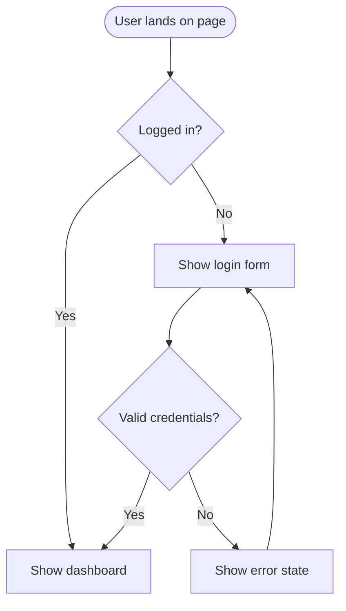

# /userflow

Generate a user flow diagram for a specific feature using Mermaid syntax.

## What I do:

1. Understand the feature/task from your description
2. Map every step a user takes — happy path + edge cases + error states
3. Output a Mermaid flowchart saved as markdown
4. Generate a React interactive version if requested

## Output files:

- `ux-docs/user-flows/[feature]-flow.md` (Mermaid diagram)
- `src/stories/ux/UserFlow.[Feature].stories.tsx` (optional interactive)

## Mermaid Template:



## Usage:

```
/userflow login
/userflow "checkout process"
/userflow onboarding --persona="Sarah the Admin"
```
